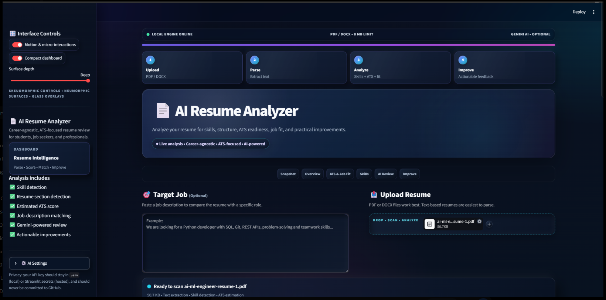
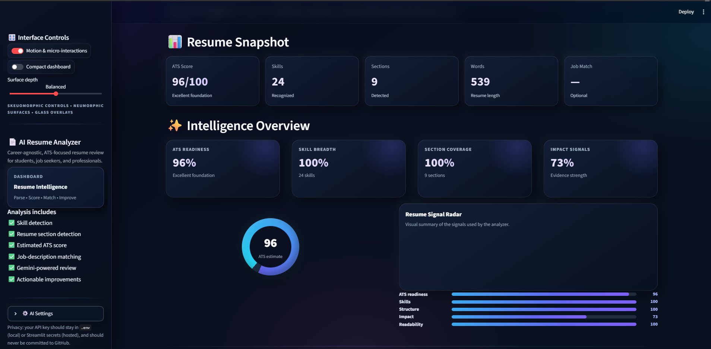
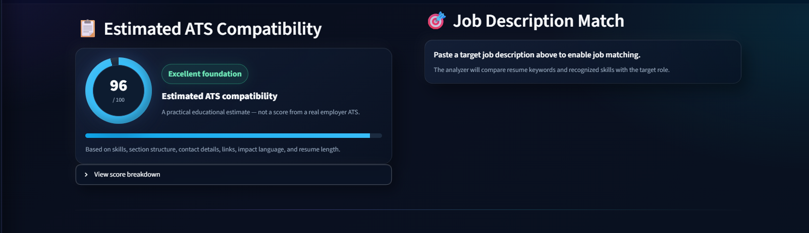
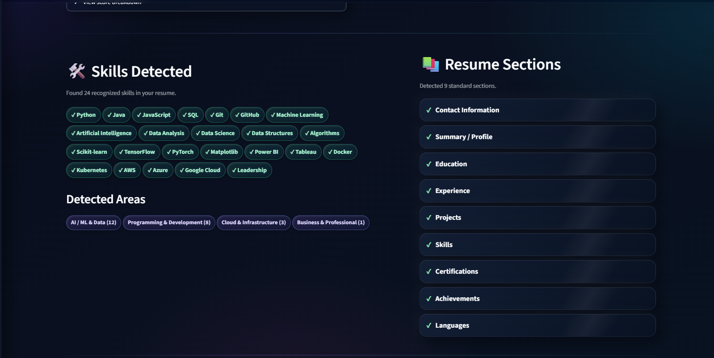
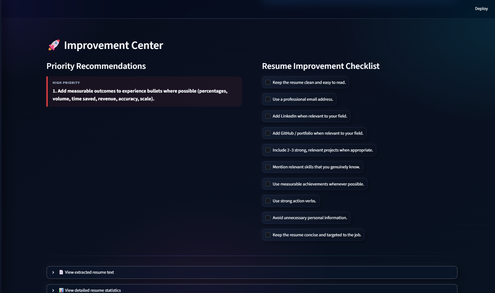

# 🤖 AI Resume Analyzer

An AI-powered resume analysis dashboard built with **Python** and **Streamlit**.

The application analyzes resumes for **skills, structure, ATS-style readiness, job-description matching, readability, and practical improvement opportunities**. It also supports an optional **Google Gemini-powered AI review**.

---

## 🚀 Live Demo

Try the deployed application:

[](https://akshat-resume-analyzer.streamlit.app/)

---

## 🛠️ Tech Stack


| Technology | Purpose |
|---|---|
| Python | Core application logic |
| Streamlit | Web application and user interface |
| PyPDF | PDF text extraction |
| python-docx | DOCX text extraction |
| python-dotenv | Environment variable management |
| Google Gemini | Optional AI-powered resume review |

---

## ✨ Features

### 📄 Resume Analysis

- Upload **PDF or DOCX** resumes
- Extract resume text locally
- Detect important resume sections
- Analyze resume length and structure
- Display detailed resume statistics
- Identify text extraction problems in scanned or image-only PDFs

### 🧠 Skill Detection

- Detect technical and professional skills
- Recognize skills across multiple career areas
- Group detected skills into broader categories
- Suggest potentially relevant additional skills
- Use safer keyword matching to reduce accidental false positives

### 📊 ATS-Style Analysis

- Educational ATS compatibility estimate
- Score breakdown across multiple resume signals
- Skills coverage analysis
- Resume structure analysis
- Contact information checks
- Online presence checks
- Achievement and impact signals
- Resume readability and length analysis

> **Note:** The ATS score is an educational estimate and is not a score generated by a real employer ATS.

### 🎯 Job Description Matching

Paste a target job description to compare it with the resume.

The analyzer evaluates:

- Resume skills
- Job-relevant keywords
- Skill overlap
- Keyword overlap
- Overall job fit
- Missing or unseen skills

### 🤖 Gemini AI Review

Optional AI-powered resume feedback using **Google Gemini**.

The AI review can provide:

- Overall resume feedback
- Strengths
- Weaknesses
- Missing or recommended skills
- ATS optimization suggestions
- Experience and achievement improvements
- Project suggestions
- Education and certification suggestions
- Keywords to consider
- Final recommendations

The application also includes:

- API key configuration handling
- Request timeout protection
- Retry handling
- Session-level cooldown between AI requests
- Protection against treating resume/job text as instructions

### 🚀 Improvement Center

Provides practical recommendations such as:

- Stronger action verbs
- Better measurable achievements
- Relevant projects
- Resume readability improvements
- LinkedIn suggestions
- GitHub / portfolio suggestions
- Resume targeting suggestions
- A resume improvement checklist

### 📦 Export

Download the analysis as a **machine-readable JSON report**.

### 🎨 Modern UI

The dashboard uses a hybrid visual design combining:

- Glassmorphism-inspired surfaces
- Neumorphic cards
- Skeuomorphic controls
- Animated micro-interactions
- Gradient accents
- Dashboard-style analytics sections
- Responsive layout adjustments

---

## 🖥️ Screenshots

### Resume Upload & Dashboard



### Intelligence Overview



### ATS Compatibility



### Skills & Resume Structure



### Improvement Center



---

## 🏗️ Project Structure

```text
AI-Resume-Analyzer/
│
├── app.py
├── requirements.txt
├── README.md
├── .gitignore
│
└── screenshots/
    ├── dashboard.png
    ├── intelligence-overview.png
    ├── ats-score.png
    ├── skills.png
    └── improvement-center.png
```

---

## ⚙️ Installation

### 1. Clone the repository

```bash
git clone https://github.com/akshatg820-max/ai-resume-analyzer.git
cd ai-resume-analyzer
```

### 2. Create a virtual environment

#### Windows

```powershell
python -m venv venv
venv\Scripts\activate
```

#### macOS / Linux

```bash
python3 -m venv venv
source venv/bin/activate
```

### 3. Install dependencies

```bash
pip install -r requirements.txt
```

### 4. Run the application

```bash
streamlit run app.py
```

The application will open at:

```text
http://localhost:8501
```

---

## 🔑 Gemini API Setup

Gemini AI review is optional. The local resume analysis works without Gemini.

### Local Development

Create a `.env` file in the project root:

```env
GEMINI_API_KEY=your_api_key_here
GEMINI_MODEL=gemini-3.6-flash
```

Replace `your_api_key_here` with your actual Gemini API key.

> **Never commit your `.env` file or expose your API key publicly.**

The `.gitignore` file is configured to keep `.env` and other local development files out of the repository.

### Streamlit Cloud Deployment

For the deployed application, store the API key using **Streamlit Secrets**.

Use:

```toml
GEMINI_API_KEY = "your_api_key_here"
GEMINI_MODEL = "gemini-3.6-flash"
```

Do not put your real API key in:

- `README.md`
- `app.py`
- GitHub commits
- screenshots
- any other public repository file

---

## 🔄 How It Works

```text
                ┌─────────────────┐
                │  Upload Resume  │
                │    PDF / DOCX   │
                └────────┬────────┘
                         │
                         ▼
                ┌─────────────────┐
                │  Extract Text   │
                │    Locally      │
                └────────┬────────┘
                         │
                         ▼
             ┌─────────────────────────┐
             │ Detect Skills & Sections│
             └────────────┬────────────┘
                          │
                          ▼
             ┌─────────────────────────┐
             │   Local Resume Analysis │
             │ ATS • Skills • Structure│
             │ Readability • Impact    │
             └────────────┬────────────┘
                          │
             ┌────────────┴────────────┐
             │                         │
             ▼                         ▼
   ┌──────────────────┐      ┌──────────────────┐
   │ Job Description  │      │ Optional Gemini  │
   │ Matching         │      │ AI Review        │
   └────────┬─────────┘      └────────┬─────────┘
            │                         │
            └────────────┬────────────┘
                         ▼
                ┌─────────────────┐
                │   Improvement   │
                │ Recommendations │
                └────────┬────────┘
                         │
                         ▼
                ┌─────────────────┐
                │   JSON Export   │
                └─────────────────┘
```

---

## 📋 Analysis Areas

| Area | What is analyzed |
|---|---|
| Skills | Recognized technical and professional skills |
| Structure | Standard resume sections |
| Contact Details | Email and phone presence |
| Online Presence | LinkedIn, GitHub, portfolio |
| Impact | Projects, metrics, and achievement language |
| Readability | Resume length and text volume |
| Job Match | Resume-to-job-description overlap |
| AI Review | Optional Gemini-powered feedback |

---

## 📈 ATS Score

The ATS-style score is calculated from multiple resume signals including:

- Skills coverage
- Resume structure
- Contact details
- Links / online presence
- Achievements and impact
- Readability and resume length

### Score Components

| Component | Maximum Points |
|---|---:|
| Skills Coverage | 25 |
| Structure | 20 |
| Contact Details | 15 |
| Links / Online Presence | 10 |
| Achievements & Impact | 15 |
| Readability & Length | 15 |
| **Total** | **100** |

> **Note:** This score is intended as a practical educational estimate and does not represent a real employer ATS score.

---

## 🔒 Privacy & Security

- Resume parsing works locally without requiring Gemini.
- Gemini review is optional.
- API keys are loaded from environment variables or Streamlit Secrets.
- `.env` is excluded from version control through `.gitignore`.
- Resume and job-description text supplied to Gemini is treated as user-provided data.
- AI-generated recommendations should be verified before being added to a resume.

> **Never commit API keys, `.env` files, or other secrets to GitHub.**

---

## ⚠️ Limitations

- ATS scoring is an educational estimate.
- It does not represent a score from a real employer ATS.
- Resume parsing quality depends on the structure of the uploaded PDF or DOCX.
- Image-only or scanned PDFs may not contain selectable text.
- Skill detection depends on the application's recognized skill database.
- Job matching uses recognized skills and keyword overlap.
- Gemini recommendations may require human verification.
- Missing skills should only be added when the candidate genuinely knows them.

---

## 🧪 Example Use Case

A typical workflow is:

1. Upload a resume.
2. Review detected skills and resume sections.
3. Check the ATS-style score.
4. Paste a target job description.
5. Compare the resume against the target role.
6. Review matched and missing skills.
7. Generate an optional Gemini AI review.
8. Follow the improvement recommendations.
9. Export the analysis as JSON.

---

## 🎓 Project Purpose

This project was developed as a practical **AI/ML and software development project** combining:

- Python programming
- Streamlit application development
- PDF/DOCX parsing
- Rule-based text analysis
- Skill detection
- ATS-style scoring
- Job-description matching
- Google Gemini API integration
- UI/UX design
- Git and GitHub
- Cloud deployment
- Secure environment-variable management

---

## 👨‍💻 Author

**Akshat Gupta**

GitHub:  
https://github.com/akshatg820-max

Project Repository:  
https://github.com/akshatg820-max/ai-resume-analyzer

Live Demo:  
https://akshat-resume-analyzer.streamlit.app/

---

## ⭐ Support

If you find this project useful, consider giving the repository a ⭐ on GitHub.

---

## 📄 License

This project is intended primarily for educational and portfolio purposes.